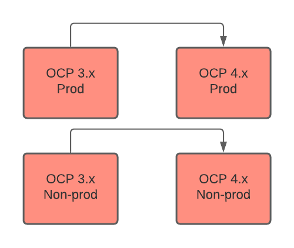
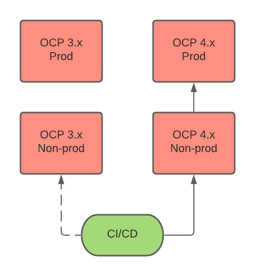

[ | <](./README.md) Planning [> Cluster health checks](./cluster-health-checks.md)
---
# Planning

This section focuses on considerations to review when you plan your migration.

* **[Migration tools](#migration-tools)**
  * [Migration Toolkit for Containers](#migration-toolkit-for-containers)
    - [When to use MTC](#when-to-use-mtc)
    - [MTC documentation](#mtc-documentation)
  * [Upstream migration tools](#upstream-migration-tools)
    - [Comparison of MTC and upstream tools](#comparison-of-mtc-and-upstream-tools)
    - [Combining MTC and upstream tools](#combining-mtc-and-upstream-tools)
* **[Migration environment considerations](#migration-environment-considerations)**
* **[Migration workflows](#migration-workflows)**
  - [MTC workflow](#mtc-workflow)
  - [CI/CD workflow](#cicd-workflow)
* **[Network traffic migration strategies](#network-traffic-migration-strategies)**
  - ["Big Bang" migration](#big-bang-migration)
  - [Individual applications](#individual-applications)
  - [Canary-style migration of individual applications](#canary-style-migration-of-individual-applications)
  - [Audience-based migration of individual applications](#audience-based-migration-of-individual-applications)

## Migration tools

### Migration Toolkit for Containers

The Migration Toolkit for Containers (MTC) migrates an application workload, including  Kubernetes resources, data, and images, from an OpenShift 3 source cluster to an OpenShift 4 target cluster.

MTC performs the migration in two stages:

1. The application workload is backed up from the source cluster to object storage.
2. The application workload is restored to the target cluster from object storage.

**Migrating Kubernetes resources**

MTC migrates all namespaced resources, including Custom Resources. MTC can dynamically discover all the API resources in each referenced namespace.

MTC migrates some cluster-scoped resources. If a namespaced resource references a cluster-scoped resource, it is migrated. Migratable resources include persistent volumes (PVs) bound to a persistent volume claim, cluster role bindings, and security context constraints.

**Migrating persistent volume data**

MTC has two options for migrating persistent volume data:

* **Move**: The PV definition is moved from the source cluster to the target cluster without touching the data. This is the fastest option.

* **Copy**: MTC copies either a *snapshot* or the *file system* of the PV.
  
See [PV move](./running-the-migration.md#pv-move) and [PV copy](./running-the-migration.md#pv-move) for requirements and details.

**Migrating internal images**

Internal images created by S2I builds are migrated. Each ImageStream reference in a given namespace is copied to the registry of the target cluster.

#### When to use MTC

Ideally, you could migrate an application from one cluster to another by redeploying the application from a pipeline and perhaps copying the persistent volume data.  

However, this might not be possible in the real world. A running application on the cluster might experience unforeseen changes and, over a period of time, drift away from the initial deploy. MTC can handle scenarios where you are not certain what your namespace contains and you want to migrate all its contents to a new cluster.

If you can redeploy your application from pipeline, that is the best option. If not, you should use MTC.

#### MTC documentation

* [Prerequisites](https://docs.openshift.com/container-platform/4.5/migration/migrating_3_4/migrating-application-workloads-3-4.html#migration-prerequisites_migrating-3-4)
* [About MTC](https://docs.openshift.com/container-platform/4.5/migration/migrating_3_4/migrating-application-workloads-3-4.html#migration-understanding-cam_migrating-3-4)
* [About data copy methods](https://docs.openshift.com/container-platform/4.5/migration/migrating_3_4/migrating-application-workloads-3-4.html#migration-understanding-data-copy-methods_migrating-3-4)

### Upstream migration tools

You can migrate PVs with [`pvc-migrate`](https://github.com/konveyor/pvc-migrate) or images with [`imagestream-migrate`](https://github.com/konveyor/imagestream-migrate).

These upstream tools offer advantages for large-scale migrations similar to the following example:

* ~50+ ImageStreams per namespace
* Multiple ~100GB+ persistent volumes

The tools are smaller and more focused. They are based on Ansible playbooks, Python code snippets, [Rsync](https://rsync.samba.org/), and [Skopeo](https://github.com/containers/skopeo), which simplifies customization and debugging. Their performance is better than MTC.

#### Comparison of MTC and upstream tools

| | MTC  | Upstream tools |
| ------------- | ------------- | ------------- |
| **Processing** |Serial processing.<br><br> MTC processes one migration plan at a time, one backup/restore operation at a time. (MTC plans to support parallel execution in the future. See [velero-487](https://github.com/vmware-tanzu/velero/issues/487).)  |Parallel processing.<br><br> `imagestream-migrate` can perform parallel image migrations. |
| **Copying** |Two copy processes.<br><br> Backup and restore.  |Single copy process. |
| **Debugging** |Challenging.<br><br> A migration error can span different clusters, namespaces, and controller logs.   |Relatively easy. <br><br>Tools are based on Ansible and Python. |
| **Customization** |Difficult. <br><br>Requires updating the Golang code, recompiling, and then updating the MTC Operator to deliver the new version. |Relatively easy. <br><br>Tools are based on Ansible and Python.  |

#### Combining MTC and upstream tools

You can use a combination of upstream tools and MTC for migration.

Before migration, check your environment for the following requirements:

* There must be a direct network connection between the source and target clusters. A process running on each node of the source cluster must be able to connect to an exposed route on the target cluster.
* The host running `pvc-migrate` requires root access to each node of the source cluster.
* PVs must be OpenShift Container Storage. `pvc-migrate` does not support other storage providers.

The migration workflow is similar to the following procedure:

1. Configure MTC to omit PVs and/or images from the migration plan by setting the following parameters in the Migration Controller manifest:
  ```
  disable_image_migration: true
  disable_pv_migration: true
  ```
2. Migrate the application workload with MTC.

3. Run `pvc-migrate` to migrate PVs and/or `imagestream-migrate` to migrate images.

## Migration environment considerations

This section describes migration environment considerations to consider when you are planning your migration:

* Consider how stored data will be migrated if you are migrating stateful applications.
* Consider how much downtime your application can tolerate during migration.
* Plan for traffic redirection during migration.

## Migration workflows

### MTC workflow

MTC migrates applications from OCP 3 to OCP 4 in production and non-production environments.

The following diagram describes the MTC workflow:



### CI/CD workflow

A CI/CD pipeline deploys applications on OCP 4 production and non-production environments.

The following diagram describes a CI/CD workflow:



## Network traffic migration strategies

This section describes strategies for migrating network traffic for stateless aplications.

* Applications are deployed on the 4.x cluster.
* If necessary, the 4.x router default certificate includes the 3.x wildcard SAN.
* Each application adds an additional route with the 3.x host name.
* Optional: The route with the 3.x host name contains an appropriate certificate.

### "Big Bang" migration

At migration, the 3.x wildcard DNS record is changed to point to the 4.x router virtual IP address (VIP).


### Individual applications

At migration, a new record is created for each application with the 3.x FQDN/host name pointing to the 4.x router VIP. This record takes precedence over the 3.x wildcard DNS record.


### Canary-style migration of individual applications

A VIP/proxy with two backends, the 3.x router VIP and the 4.x router VIP, is created for each application.

At migration, a new record is created for each application with the 3.x FQDN/host name pointing to the VIP/proxy. This record takes precedence over the 3.x wildcard DNS record.

The proxy entry for the application is configured to route `X`% of the traffic to the 3.x router VIP and (100-`X`)% of the traffic to the 4.x VIP.

`X` is gradually moved from `100` to `0`.


### Audience-based migration of individual applications

A VIP/proxy with two backends, the 3.x router VIP and the 4.x router VIP, is created for each application.

At migration, a new record is created for each application with the 3.x FQDN/host name pointing to the VIP/proxy. This record takes precedence over the 3.x wildcard DNS record.

The proxy entry for the application is configured to route traffic matching a given header pattern, for example, test customers, to the 4.x router VIP and the rest of the traffic to the 3.x VIP.

Traffic is moved to the 4.x VIP in waves until all the traffic is on the 4.x VIP.


