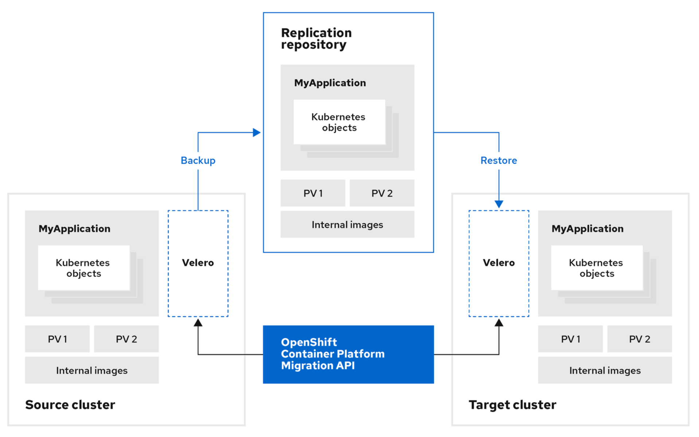

[](./README.md) |  [Cluster health checks <](./cluster-health-checks.md) Premigration testing [> Running the migration](./running-the-migration.md)
---
# Premigration testing

* [Installing MTC](#installing-mtc)
* [Ensuring same MTC versions](#ensuring-same-mtc-versions)
* [Checking 'OLM Managed' setting](#checking-olm-managed-setting)
* [Migrating a simple application](#migrating-a-simple-application)
* [Migrating an application with a persistent volume](#migrating-an-application-with-a-persistent-volume)
* [Removing migrated application namespace](#removing-migrated-application-namespace)

## Installing MTC

Install MTC on your source and target clusters:

* Check the [migration prerequisites](https://docs.openshift.com/container-platform/4.5/migration/migrating_3_4/migrating-application-workloads-3-4.html#migration-prerequisites_migrating-3-4).
* [Install MTC](https://docs.openshift.com/container-platform/4.5/migration/migrating_3_4/deploying-cam-3-4.html) on the source and target clusters.
* [Configure a replication repository](https://docs.openshift.com/container-platform/4.5/migration/migrating_3_4/configuring-replication-repository-3-4.html).

The following diagram describes how MTC uses Velero and Restic to back up data from the source cluster to the replication repository and then restores data from the replication repository to the target cluster:



## Ensuring same MTC versions

The same MTC z-stream version must be installed on the source and target clusters.

Download and re-install the MTC Operator on the OpenShift 3 cluster just before you run a migration to ensure that you have the latest version.

The Operator Lifecycle Manager (OLM) pushes MTC Operator updates to the OpenShift 4 cluster automatically. On the OpenShift 3 cluster, however, the MTC Operator is installed manually and is not updated automatically.

## Checking 'OLM Managed' setting

In the web console, check the 'OLM Managed' setting in the 'MigrationController' manifest of each cluster:

* OpenShift 4 uses OLM:
  ```yaml
  olm_managed: true
  ```
* OpenShift 3 does not use OLM:
  ```yaml
  olm_managed: false
  ```

## Migrating a simple application

Migrate a simple application without a persistent volume (PV):

1. Install a simple application without a PV on the source cluster.
2. [Migrate the application](https://docs.openshift.com/container-platform/4.5/migration/migrating_3_4/migrating-applications-with-cam-3-4.html) to the target cluster. You do not need to stage the migration.
3. Validate the application on the target cluster.

## Migrating an application with a persistent volume

Migrate an application with a PV:

1. Install an application with an associated PV on the source cluster.
2. Stage the migration one or more times. Staging reduces migration time and application downtime during migration.
3. Migrate the application to the target cluster.
4. Validate the application on the target cluster.

## Removing a migrated application namespace

If you are performing multiple test migrations, remove the migrated application namespace from the target cluster after each test.

