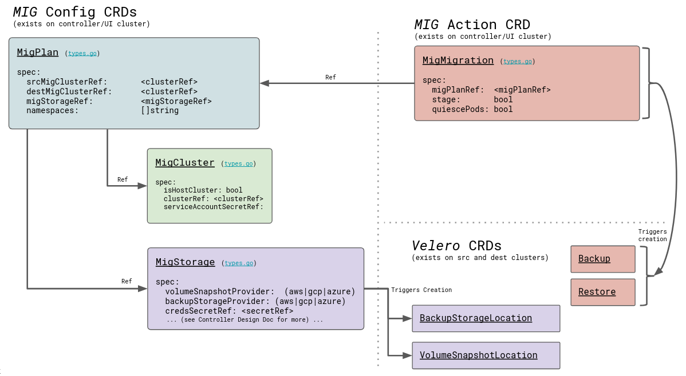

[](./README.md) | [Running the migration <](./running-the-migration.md) Troubleshooting
---
# Troubleshooting

This section describes common troubleshooting procedures.

* **[MTC data model](#mtc-data-model)**
* **[Debugging tips](#debugging-tips)**
* **[Error messages](#error-messages)**
* **[Using `must-gather`](#using-must-gather)**
* **[Performance metrics](#performance-metrics)**
* **[Cleaning up a failed migration](#cleaning-up-a-failed-migration)**
* **[Deleting the MTC Operator and resources](#deleting-the-mtc-operator-and-resources)**

Upstream doc for improving debug experience
* https://github.com/konveyor/enhancements/tree/master/enhancements/debug

Debug flowchart (in progress)
* [MTC Debug flowchart](https://app.lucidchart.com/documents/view/d0907ce1-ccf1-4226-86eb-e5332f9d42a4/0_0)

# MTC custom resources

The following diagram describes the MTC custom resources (CRs). Each object is a standard Kubernetes CR.

You can manage the MTC resources with the standard create, read, update, and delete operations using the `kubectl` and `oc` clients or directly, using the web interface.

TODO: Need to update diagram with MigAnalytic and MigHook



# Debugging tips

You can view the resources of a migration plan in the MTC web console:

1. Click the Options menu beside a migration plan and select **View migration plan resources**.

    The migration plan resources are displayed as a tree.

2. Click the arrow of a **Backup** or **Restore** object to view its pods.
   
3. Click the Copy button of a pod to copy the `oc get` command to your clipboard.

    You can paste the command to the CLI to view the resource details.

4. Click **View Raw** to inspect a pod.

    The resource is displayed in JSON format.


Typically, the objects that you are interested in depend on the stage at which the
migration failed. The [MTC debug flowchart](https://app.lucidchart.com/documents/view/d0907ce1-ccf1-4226-86eb-e5332f9d42a4/0_0) provides information about what objects are relevant depending on this failure stage.

Stage migrations have one Backup and one Restore object.

Final migrations have two Backup and two Restore objects. The first Backup object captures the original, unaltered state of the application and its Kubernetes objects. This Backup is the source of truth. Then, the application is quiesced and a second Backup captures the storage-related resources (PVs, PVCs, data). 

The first Restore restores these storage objects on the target cluster. The final Restore restores the original application Backup to the target cluster.

## Querying the migration resources from the CLI

The migration debug tree can be viewed and traced by querying specific label selectors.

- To view all `migmigration` objects associated with the `test` plan:
    ```sh
    $ oc get migmigration -l 'migration.openshift.io/migplan-name=test'
    ```
    Output:
    ```
    NAME                                  READY  PLAN  STAGE  ITINERARY  PHASE
    09a8bf20-fdc5-11ea-a447-cb5249018d21         test  false  Final      Completed
    ```

    The columns display the associated plan name, itinerary step, and phase.

- To view `backup` objects:
    ```sh
    $ oc get backup -n openshift-migration
    ```
    Output:
    ```
    NAME                                   AGE
    88435fe0-c9f8-11e9-85e6-5d593ce65e10   6m42s
    ```
    Use the same command to view `restore` objects.

- To inspect a `backup` object:
    ```sh
    $ oc describe backup 88435fe0-c9f8-11e9-85e6-5d593ce65e10 -n openshift-migration
    ```

See [Viewing migration custom resources](https://docs.openshift.com/container-platform/4.6/migration/migrating_3_4/troubleshooting-3-4.html#migration-viewing-migration-crs_migrating-3-4) for more information.

# Error messages

## `certificate error` when logging in to the MTC console for the first time

The following error message might appear when you log in to the MTC console for the first time:

```
A certificate error has occurred, likely caused by using self-signed CA certificates in one of the clusters. Navigate to the following URL and accept the certificate:
`https://ocp-cluster.com:6443/.well-known/oauth-authorization-server`.

If an "Unauthorized" message appears after you have accepted the certificate, refresh the web page.

To fix this issue permanently, add the certificate to your web browser's trust store.
```

Possible causes are self-signed certificates or network access issues.

Self-signed CA certificates:

* You can navigate to the `oauth-authorization-server` URL and accept the certificate.
* You can add self-signed certificates for the API server, OAuth server, and routes to your web browser's trusted store.

Network access:
* You can inspect the elements of the MTC console with your browser's web inspector to view the network connections.
* MTC 1.3.1 and earlier: The MTC console performs OAuth authentication on the client side.
      
    The console requires uninterrupted network access to the API server and the OAuth server.

* MTC 1.3.2 and later: OAuth authentication is performed on the backend.
      
    The console requires uninterrupted network access to the Node.js server, which provides the JavaScript bundle and performs OAuth authentication, and the API server. See [BZ#1878824](https://bugzilla.redhat.com/show_bug.cgi?id=1878824).

## `Connection has timed out` message after accepting CA certificate

If you have accepted a self-signed certificate and a blank page appears, followed by a `Connection has timed out` message, the likely cause is a web proxy blocking access to the OAuth server.
    
Configure the web proxy configuration to allow access to the `oauth-authorization-server` URL. See [BZ#1890675](https://bugzilla.redhat.com/show_bug.cgi?id=1890675).

# Using `must-gather`

You can use the `must-gather` tool to collect information for troubleshooting or for opening a customer support case on the [Red Hat Customer Portal](https://access.redhat.com/). The `openshift-migration-must-gather-rhel8` image collects migration-specific logs and Custom Resource data that are not collected by the default `must-gather` image.

Run the `must-gather` command on your cluster:
````sh
$ oc adm must-gather --image=openshift-migration-must-gather-rhel8:v1.3.0
````

A directory will be created which will contain the data collected by the `must-gather` tool.

## Previewing metrics on local Prometheus server

You can use `must-gather` to create a metrics data directory dump from the last day:
````sh
$ oc adm must-gather --image quay.io/konveyor/must-gather:latest -- /usr/bin/gather_metrics_dump
````

You can view the data with a [local Prometheus instance](https://github.com/konveyor/must-gather#preview-metrics-on-local-prometheus-server).

# Performance metrics

For information about the metrics recorded by the MTC controller, see the [`mig-operator` documentation](https://github.com/konveyor/mig-operator/blob/master/docs/usage/Metrics.md#accessing-mig-controller-prometheus-metrics).

This documentation includes [useful queries](https://github.com/konveyor/mig-operator/blob/master/docs/usage/Metrics.md#useful-queries) for performance monitoring.

# Cleaning up a failed migration

## Deleting resources

Ensure that stage pods are cleaned up. If a migration fails during stage or copy, the stage pods are retained to allow debugging. Before retrying a migration, you must delete the stage pods manually.

## Unquiescing an application

If your application was quiesced during migration, you should unquiesce it by scaling it back to its initial replica count.

This can be done manually by editing the deployment primitive (Deployment, DeploymentConfig, etc.) and setting the `spec.replicas` field back to its original, non-zero value:

```sh
$ oc edit deployment <deployment_name>
```

Alternatively, you can scale your deployment with the `oc scale` command:

```sh
$ oc scale deployment <deployment_name> --replicas=<desired_replicas>
```

## Note on labels applied to help track what was migrated

While quiescing a source application, MTC annotates the original replica count on the deployment object for reference:

```yaml
apiVersion: extensions/v1beta1
kind: Deployment
metadata:
  annotations:
    deployment.kubernetes.io/revision: "1"
    migration.openshift.io/preQuiesceReplicas: "1"
```

# Deleting the MTC Operator and resources

The following procedure removes the MTC Operator and cluster-scoped resources:

1. Delete the Migration Controller and its resources:
    ````sh
    $ oc delete migrationcontroller <resource_name>
    ````
    Wait for the MTC Operator to finish deleting the resources.

2. Uninstall the MTC Operator:
    * OpenShift 4: Uninstall the Operator in the [web console](https://docs.openshift.com/container-platform/4.6/operators/olm-deleting-operators-from-cluster.html) or by running the following command: 
    ````sh
    $ oc delete ns openshift-migration
    ````

    * OpenShift 3: Uninstall the operator by deleting it:
      ````sh
      $ oc delete -f operator.yml
      ````

4. Delete the cluster-scoped resources:
    * Migration custom resource definition:
      ````sh
      $ oc delete $(oc get crds -o name | grep 'migration.openshift.io')
      ````  
    * Velero custom resource definition:
      ````sh
      $ oc delete $(oc get crds -o name | grep 'velero')
      ````  
    * Migration cluster role:
      ````sh
      $ oc delete $(oc get clusterroles -o name | grep 'migration.openshift.io')
      ````  
    * Velero cluster role:
      ````sh
      $ oc delete $(oc get clusterroles -o name | grep 'velero')
      ````  
    * Migration cluster role bindings:
      ````sh
      $ oc delete $(oc get clusterrolebindings -o name | grep 'migration.openshift.io')
      ````  
    * Velero cluster role bindings:
      ````sh
      $ oc delete $(oc get clusterrolebindings -o name | grep 'velero')
      ```` 

